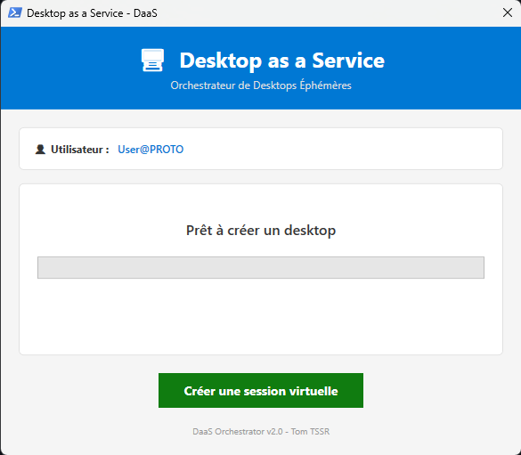
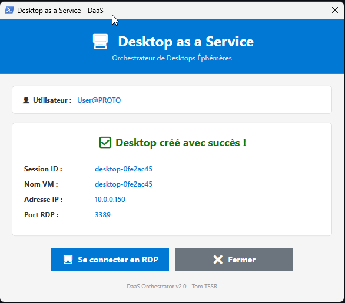
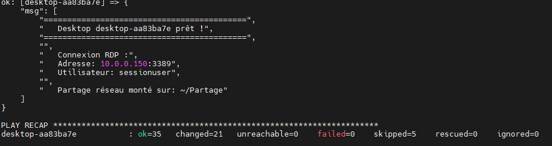
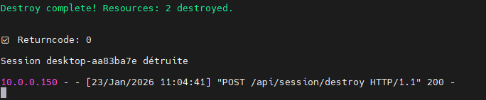

# Projet : Orchestrateur de Desktops Éphémères

> Infrastructure automatisée de provisioning de postes de travail Linux à la demande avec intégration Active Directory

[](https://opensource.org/licenses/MIT)
[](https://www.python.org/)
[](https://www.terraform.io/)
[](https://www.ansible.com/)

## Table des matières

- I. [**Présentation**](#i-présentation)
- II. [**Architecture**](#ii-architecture)
- III. [**Fonctionnalités**](#iii-fonctionnalités)
- IV. [**Technologies utilisées**](#iv-technologies-utilisées)
- V. [**Installation**](#v-installation)
- VI. [**Utilisation**](#vi-utilisation)
- VII. [**Documentation**](#vii-documentation)
- VIII. [**Captures d'écran**](#viii-captures-décran)
- IX. [**Auteur**](#ix-auteur)


---

## I. Présentation

Ce projet implémente une solution **Desktop as a Service (DaaS)** permettant de provisionner automatiquement des postes de travail Linux éphémères à la demande. Similaire aux solutions commerciales type Citrix ou VMware Horizon, mais basé sur des technologies open-source.

### Cas d'usage

- **Entreprises** : Fournir des postes de travail temporaires aux employés/consultants
- **Formation** : Créer rapidement des environnements de TP pour des sessions de formation
- **Tests** : Environnements jetables pour tester des configurations
- **Télétravail** : Accès sécurisé à un desktop d'entreprise depuis n'importe où

### Workflow utilisateur
```
1. L'utilisateur double-clique sur un raccourci (Windows ou Linux)
2. L'orchestrateur crée automatiquement un desktop Linux en 2-3 minutes
3. La connexion RDP s'ouvre automatiquement
4. L'utilisateur travaille dans son environnement isolé
5. À la déconnexion, le desktop est automatiquement détruit
```

---

## II. Architecture

### Vue d'ensemble


### Composants

| Composant | Rôle | Technologies |
|-----------|------|--------------|
| **Orchestrateur** | API REST, gestion des sessions | Flask (Python), systemd |
| **Provisioning** | Création automatique des VMs | Terraform, Proxmox API |
| **Configuration** | Installation et config logiciels | Ansible, cloud-init |
| **Infrastructure** | Hyperviseur de virtualisation | Proxmox VE |
| **Clients** | Scripts de demande de desktop | PowerShell, bash |
| **Annuaire** | Authentification centralisée | Active Directory |
| **Partage fichiers** | Montage automatique du home | Samba, pam_mount |

---

## III. Fonctionnalités

### Provisioning automatique
- ✅ Création de VM en 2-3 minutes
- ✅ Noms auto-générés (desktop-XXXXX)
- ✅ Configuration réseau automatique (DHCP)
- ✅ Templates optimisés (cloud-init)

### Intégration Active Directory
- ✅ Jointure automatique au domaine
- ✅ Authentification via credentials AD
- ✅ Support de tous les utilisateurs du domaine
- ✅ Pas de gestion de comptes locaux

### Partage de fichiers
- ✅ Montage automatique du partage Samba personnel
- ✅ Utilisation des credentials AD de l'utilisateur
- ✅ Accès transparent au home directory réseau
- ✅ Configuration via pam_mount

### Accès distant
- ✅ Protocole RDP (compatible Windows/Linux/Mac)
- ✅ Connexion automatique depuis les scripts clients
- ✅ Interface graphique XFCE légère et réactive
- ✅ Support copier-coller entre client et desktop

### Gestion du cycle de vie
- ✅ Destruction automatique à la déconnexion
- ✅ Monitoring d'inactivité (30 minutes)
- ✅ Protection contre les VMs zombies
- ✅ Cleanup automatique des ressources

### Multi-plateforme
- ✅ Scripts clients pour Windows (PowerShell)
- ✅ Scripts clients pour Linux (bash)
- ✅ Scripts clients pour macOS (bash)
- ✅ API REST accessible depuis n'importe quel langage

---

## VI. Technologies utilisées

### Backend
- **Python 3.10+** - Langage principal de l'orchestrateur
- **Flask 3.x** - Framework web pour l'API REST
- **Terraform 1.0+** - Infrastructure as Code
- **Ansible 2.9+** - Configuration Management
- **systemd** - Gestion du service orchestrateur

### Infrastructure
- **Proxmox VE 8.x** - Hyperviseur de virtualisation
- **Ubuntu 22.04 LTS** - OS des desktops
- **cloud-init** - Configuration initiale des VMs

### Réseau & Sécurité
- **Active Directory** - Annuaire et authentification
- **Samba 4.x** - Partage de fichiers réseau
- **PAM (pam_mount)** - Montage automatique des partages
- **SSSD** - Intégration Linux-AD

### Bureau à distance
- **XRDP** - Serveur RDP pour Linux
- **XFCE4** - Environnement de bureau léger
- **xfreerdp** - Client RDP Linux
- **mstsc** - Client RDP Windows

### Développement
- **Git** - Gestion de version
- **VBScript** - Lanceur Windows (bypass ExecutionPolicy)

---

## V. Installation

### Prérequis

- Serveur Ubuntu 22.04 LTS avec :
  - Python 3.10+
  - Ansible
  - Terraform
  - Accès SSH
  - 4 Go RAM minimum

- Proxmox VE 8.x avec :
  - Template Ubuntu 22.04 cloud-init
  - Réseau configuré (vmbr2)
  - API token créé

- Active Directory fonctionnel

- Serveur Samba avec partages configurés

### Guide d'installation complet

Voir [INSTALLATION.md](docs/INSTALLATION.md) pour les instructions détaillées.

**Installation rapide** :
```bash
# 1. Cloner le repository
git clone https://github.com/TomGn1/daas-project.git
cd daas-project

# 2. Configurer Terraform
cd terraform/ephemeral
cp terraform.tfvars.example terraform.tfvars
nano terraform.tfvars  # Ajouter les credentials Proxmox

# 3. Configurer Ansible
cd ../../ansible
cp group_vars/all/vault.yml.example group_vars/all/vault.yml
ansible-vault edit group_vars/all/vault.yml  # Ajouter le mot de passe AD

# 4. Installer l'orchestrateur
cd ../orchestrator
python3 -m venv venv
source venv/bin/activate
pip install flask

# 5. Créer le service systemd
sudo cp orchestrator-daas.service /etc/systemd/system/
sudo systemctl enable orchestrator-daas
sudo systemctl start orchestrator-daas
```

---

## VI. Utilisation

### Pour les utilisateurs finaux

#### Windows
1. Double-cliquer sur `Launch-DaaS.vbs` sur le bureau
2. Attendre 2-3 minutes (création du desktop)
3. RDP s'ouvre automatiquement
4. Travailler normalement
5. Fermer la fenêtre RDP → Desktop détruit automatiquement

#### Linux
1. Double-cliquer sur l'icône "Desktop Éphémère" sur le bureau
2. Attendre 2-3 minutes
3. xfreerdp s'ouvre automatiquement en plein écran
4. Travailler normalement
5. Fermer la fenêtre → Desktop détruit automatiquement

### Pour les administrateurs

#### Surveiller l'orchestrateur
```bash
# Statut du service
sudo systemctl status orchestrator-daas

# Logs en temps réel
sudo journalctl -u orchestrator-daas -f

# Voir les sessions actives
curl http://<server_ip>:5000/api/sessions
```

#### Créer manuellement un desktop
```bash
curl -X POST http://<server_ip>:5000/api/session/create \
  -H "Content-Type: application/json" \
  -d '{"username": "utilisateur"}'
```

#### Détruire manuellement un desktop
```bash
curl -X POST http://<server_ip>:5000/api/session/destroy \
  -H "Content-Type: application/json" \
  -d '{"session_id": "desktop-abc123"}'
```

---

## VII. Documentation

- [ARCHITECTURE.md](docs/ARCHITECTURE.md) - Architecture détaillée du système
- [INSTALLATION.md](docs/INSTALLATION.md) - Guide d'installation pas à pas
- [USER_GUIDE.md](docs/USER_GUIDE.md) - Guide utilisateur complet
- [TECHNICAL.md](docs/TECHNICAL.md) - Documentation technique pour développeurs

---

## VIII. Captures d'écran

### Script client Windows





### Desktop XFCE


### Proxmox - VM


### Orchestrateur - Logs






---

## Contexte du projet

Ce projet a été réalisé dans le cadre de ma formation **TSSR (Technicien Supérieur Systèmes et Réseaux)** pour démontrer les compétences suivantes :

- Virtualisation et gestion d'infrastructure
- Automatisation (IaC et Configuration Management)
- Développement d'API REST
- Intégration Active Directory
- Scripting multi-plateforme
- Services systemd et gestion de processus
- Architecture client-serveur

---

## IX. Auteur

**Tom** - Étudiant TSSR

- GitHub: [@TomGn1](https://github.com/TomGn1)
- LinkedIn: [Tom GUENIN](https://www.linkedin.com/in/tom-guenin-160510296)

---

## Licence

Ce projet est sous licence MIT - voir le fichier [LICENSE](LICENSE) pour plus de détails.

---

## Remerciements

- La communauté Proxmox pour l'excellent hyperviseur
- HashiCorp pour Terraform
- Red Hat pour Ansible
- L'équipe Flask pour le framework web
