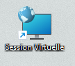
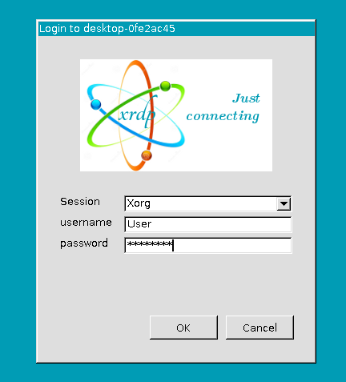
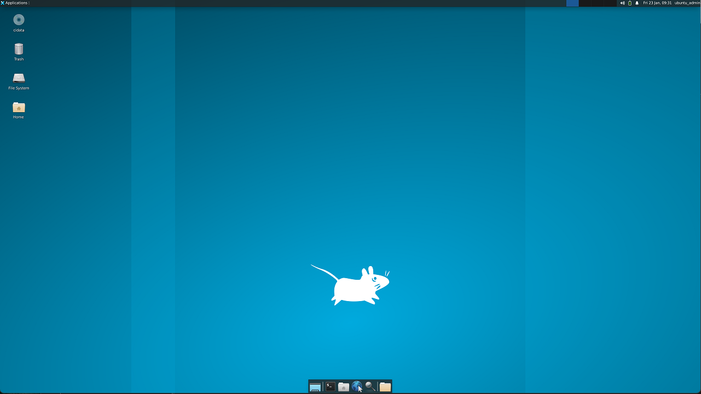

# Guide utilisateur - Desktop as a Service

Guide d'utilisation du système Desktop as a Service pour les utilisateurs finaux.

---

## Table des matières

- [Qu'est-ce que le DaaS ?](#quest-ce-que-le-daas-)
- [Prérequis](#prérequis)
- [Demander un desktop](#demander-un-desktop)
- [Se connecter au desktop](#se-connecter-au-desktop)
- [Utiliser le desktop](#utiliser-le-desktop)
- [Fermer le desktop](#fermer-le-desktop)
- [FAQ](#faq)
- [Support](#support)

---

## Qu'est-ce que le DaaS ?

Le **Desktop as a Service** (DaaS) vous permet d'obtenir instantanément un poste de travail Linux virtuel accessible depuis n'importe où.

### Cas d'usage

- **Travail à distance** : Accéder à votre environnement de travail depuis la maison
- **Poste temporaire** : Besoin d'un PC pour une réunion ou une présentation
- **Tests** : Environnement jetable pour tester des logiciels
- **Formation** : Environnement standardisé pour les TP

### Avantages

✅ **Rapide** : Votre desktop est prêt en 2-3 minutes  
✅ **Sécurisé** : Authentification avec vos identifiants habituels (Active Directory)  
✅ **Accessible** : Depuis Windows, Linux ou macOS  
✅ **Automatique** : Aucune configuration manuelle requise  
✅ **Éphémère** : Le desktop est automatiquement supprimé après utilisation  

---

## Prérequis

### Pour tous les utilisateurs

- Compte Active Directory actif (domaine PROTO)
- Connexion réseau au domaine (VPN si distant)
- Mot de passe Active Directory à jour

### Selon votre système d'exploitation

#### Windows
- Windows 10 ou 11
- Client Bureau à distance (intégré dans Windows)

#### Linux
- Ubuntu 20.04+ (ou autre distribution récente)
- FreeRDP installé (`sudo apt install freerdp2-x11`)

#### macOS
- macOS 10.14+
- Microsoft Remote Desktop (depuis App Store)

---

## Demander un desktop

### 🪟 Sur Windows

#### Méthode 1 : Raccourci bureau (recommandé)

1. **Double-cliquez** sur l'icône "Session Virtuelle" sur votre bureau

   

2. Une fenêtre PowerShell s'ouvre avec le message :
```
   ╔══════════════════════════════════════════╗
   ║     Desktop as a Service (DaaS)          ║
   ╚══════════════════════════════════════════╝
   
   Demande de desktop en cours pour: VotreNom
```

3. **Patientez 2-3 minutes** pendant la création du desktop

4. La connexion Bureau à distance s'ouvre **automatiquement**

#### Méthode 2 : Lanceur VBS

Si vous n'avez pas de raccourci bureau :

1. Ouvrir l'Explorateur de fichiers
2. Naviguer vers `C:\Scripts`
3. Double-cliquer sur `Launch-DaaS.vbs`

---

### 🐧 Sur Linux

#### Méthode 1 : Raccourci bureau (recommandé)

1. **Double-cliquez** sur l'icône "Session Virtuelle" sur votre bureau

2. Un terminal s'ouvre avec :
```
   ╔══════════════════════════════════════════╗
   ║     Desktop as a Service (DaaS)          ║
   ╚══════════════════════════════════════════╝
   
   Demande de desktop en cours pour: votreuser
```

3. **Patientez 2-3 minutes**

4. xfreerdp s'ouvre **automatiquement** en plein écran

#### Méthode 2 : Script en ligne de commande
```bash
# Ouvrir un terminal
cd ~
./request-desktop.sh
```

---

### 🍎 Sur macOS

1. Ouvrir un terminal
2. Lancer le script :
```bash
   ~/request-desktop.sh
```
3. Microsoft Remote Desktop s'ouvrira (à installer depuis l'App Store si nécessaire)

---

## Se connecter au desktop

### Écran de connexion

Une fois le desktop créé, vous verrez l'écran de connexion RDP :



### Saisir vos identifiants

| Champ | Valeur |
|-------|--------|
| **Domaine** | `PROTO` |
| **Nom d'utilisateur** | Votre login AD (ex: `jdupont`) |
| **Mot de passe** | Votre mot de passe AD habituel |

> [!IMPORTANT]
> **Important** : Utilisez vos identifiants Active Directory, PAS un compte local !

### Première connexion

Si c'est votre première connexion :
- Accepter le certificat de sécurité (avertissement normal)
- Le chargement du bureau peut prendre 10-20 secondes

---

## Utiliser le desktop

### Interface XFCE

Votre desktop utilise l'environnement **XFCE**, léger et intuitif.



#### Menu Applications

Cliquez sur **"Applications"** en haut à gauche pour accéder à :

- **Internet** : Firefox, Thunderbird
- **Bureautique** : LibreOffice (Writer, Calc, Impress)
- **Gestionnaire de fichiers** : Thunar
- **Terminal** : Ligne de commande
- **Paramètres** : Configuration du bureau

### Votre dossier réseau

Le dossier `Partage` dans votre répertoire personnel est **automatiquement connecté** au serveur de fichiers de l'entreprise.
```bash
/home/votreuser/Partage
```

**Utilisez-le pour** :
- Enregistrer vos fichiers de travail
- Accéder à vos documents partagés
- Sauvegarder vos travaux

> [!IMPORTANT]
> **Important** : Les fichiers en dehors de `Partage` seront **perdus** à la fermeture du desktop !

### Copier-coller entre votre PC et le desktop

Le copier-coller est **activé par défaut** :

- **Windows** : Ctrl+C / Ctrl+V fonctionnent entre les deux
- **Linux** : Ctrl+C / Ctrl+V ou clic-molette

### Raccourcis clavier utiles

| Action | Windows RDP | Linux xfreerdp |
|--------|-------------|----------------|
| **Plein écran** | Ctrl+Alt+Pause | F11 |
| **Quitter plein écran** | Ctrl+Alt+Pause | F11 |
| **Barre connexion** | Cliquer en haut | — |

---

## Fermer le desktop

### ⚠️ Sauvegarder vos travaux

**Avant de fermer, assurez-vous que** :
- Vos fichiers sont dans le dossier `Partage`
- Tous vos documents sont sauvegardés
- Aucun travail important n'est en cours

> [!CAUTION]
> **Rappel** : Le desktop sera **définitivement supprimé** après fermeture !

### Méthodes de fermeture

#### Méthode 1 : Se déconnecter (recommandé)

Dans le desktop XFCE :

1. Cliquer sur **"Applications"** (en haut à gauche)
2. Aller dans **"Déconnexion"**
3. Choisir **"Se déconnecter"**

Le desktop sera automatiquement détruit après votre déconnexion.

#### Méthode 2 : Fermer le client RDP

- **Windows** : Cliquer sur  ❌ en haut de la fenêtre RDP
- **Linux** : Fermer la fenêtre xfreerdp (ou appuyer sur `Ctrl+Alt+Enter`)

Le desktop sera automatiquement détruit dans les **60 secondes** suivant la déconnexion.

### Que se passe-t-il après ?
```
1. Vous fermez RDP
   ↓
2. Le script client attend 10 secondes
   ↓
3. Appel automatique à l'orchestrateur
   ↓
4. Le desktop est supprimé (~30 sec)
   ↓
5. Toutes les ressources sont libérées
```

Le script affiche :
```
Session RDP terminée !

Destruction automatique du desktop...
La VM sera détruite dans 10 secondes...
   10 secondes...
   9 secondes...
   ...
Desktop détruit avec succès !

Terminé !
```

---

## FAQ

### Questions générales

#### Combien de temps faut-il pour créer un desktop ?

**2 à 3 minutes** en moyenne :
- 1 minute pour créer la machine virtuelle
- 1-2 minutes pour installer et configurer les logiciels

#### Combien de temps puis-je garder mon desktop ?

Aussi longtemps que vous en avez besoin ! Cependant :
- Après **30 minutes d'inactivité**, le desktop sera automatiquement supprimé
- **Pensez à sauvegarder** régulièrement dans `Partage`

#### Puis-je créer plusieurs desktops en même temps ?

Non, **un seul desktop par utilisateur** à la fois. Si vous essayez d'en créer un deuxième, vous recevrez un message d'erreur.

#### Mes fichiers sont-ils sauvegardés ?

- **OUI** : Les fichiers dans `~/Partage` (dossier réseau)
- **NON** : Tous les autres fichiers sur le desktop

**Recommandation** : Enregistrez toujours vos travaux dans `Partage` !


---

### Problèmes courants

#### Le desktop ne se crée pas

**Symptômes** : Le script affiche une erreur ou reste bloqué

**Solutions** :
1. Vérifier votre connexion réseau
2. Vérifier que l'orchestrateur est accessible :
```bash
   ping 10.0.0.7
```
3. Réessayer dans quelques minutes
4. Contacter le support si le problème persiste

#### Je ne peux pas me connecter avec mes identifiants

**Symptômes** : Message "Échec de l'authentification"

**Solutions** :
1. Vérifier que vous utilisez vos identifiants **Active Directory** :
   - Domaine : `PROTO`
   - Username : Votre login habituel
   - Password : Votre mot de passe AD
2. Vérifier que votre compte AD est actif
3. Réinitialiser votre mot de passe AD si nécessaire

#### Le dossier Partage est vide

**Symptômes** : Le dossier `~/Partage` existe mais ne contient rien

**Solutions** :
1. Vérifier que vous êtes bien connecté avec votre compte AD
2. Se déconnecter et se reconnecter
3. Vérifier avec l'IT que vous avez accès au partage réseau

#### La connexion RDP est lente

**Symptômes** : L'affichage est saccadé ou lent

**Solutions** :
1. Vérifier votre connexion Internet (besoin de 5+ Mbps)
2. Réduire la résolution de l'écran :
   - Windows : Paramètres RDP avant connexion
   - Linux : Modifier les options xfreerdp dans le script
3. Fermer d'autres applications gourmandes en réseau

#### Le desktop ne se détruit pas automatiquement

**Symptômes** : Après fermeture RDP, le desktop reste actif

**Solutions** :
1. Attendre 60 secondes (délai de détection)
2. Détruire manuellement via le script :
   - Le script vous propose cette option
3. Contacter l'IT pour destruction manuelle si nécessaire

---

### Sécurité

#### Mes données sont-elles sécurisées ?

**Oui** :
- Authentification via Active Directory
- Connexion RDP chiffrée
- Desktop isolé (pas d'accès aux autres utilisateurs)
- Destruction complète après usage (aucune donnée résiduelle)


#### Que se passe-t-il si j'oublie de fermer le desktop ?

Le desktop sera **automatiquement détruit** après **30 minutes d'inactivité**.

Vos fichiers dans `Partage` seront sauvegardés, mais tout le reste sera perdu.

---

## Bonnes pratiques

### ✅ À faire

- Sauvegarder régulièrement dans `Partage`
- Fermer proprement le desktop après usage
- Utiliser vos identifiants AD personnels
- Signaler les problèmes au support

### ❌ À ne pas faire

- Partager vos identifiants avec d'autres personnes
- Enregistrer des données sensibles en dehors de `Partage`
- Laisser le desktop ouvert inutilement
- Essayer de créer plusieurs desktops simultanément

---

## Astuces

### Productivité

**Raccourcis Firefox** (dans le desktop) :
- `Ctrl+T` : Nouvel onglet
- `Ctrl+W` : Fermer l'onglet
- `Ctrl+Shift+T` : Rouvrir l'onglet fermé

**Terminal rapide** :
- Applications → Terminal
- OU clic droit sur le bureau → "Ouvrir un terminal ici"

**Capture d'écran** :
- `Print Screen` : Capture complète
- `Alt+Print Screen` : Capture de la fenêtre active

### Performance

**Pour une connexion plus fluide** :
- Fermer les applications inutilisées dans le desktop
- Désactiver les effets visuels (Paramètres → Bureau)
- Réduire la résolution si connexion lente

**Optimiser l'espace disque** :
- Vider la corbeille régulièrement
- Supprimer les téléchargements temporaires

---

## Changelog utilisateur

### Version 1.0 (21/11/2025)

**Nouvelles fonctionnalités** :
- Création automatique de desktops éphémères
- Connexion RDP automatique
- Montage automatique du dossier Partage
- Destruction automatique après déconnexion

**Améliorations** :
- Temps de création réduit à 2-3 minutes
- Interface XFCE légère et réactive
- Support multi-plateforme (Windows, Linux, macOS)

---

