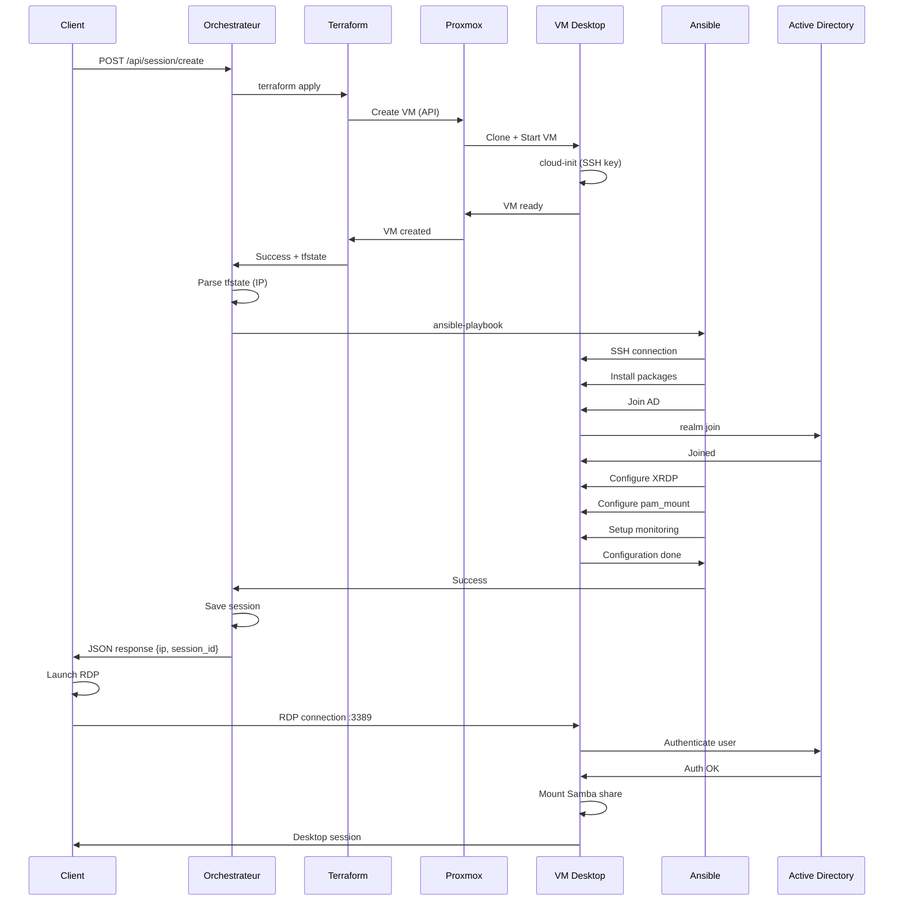

# 🏗️ Architecture du système DaaS

Ce document décrit l'architecture technique complète du système Desktop as a Service.

---

## Table des matières

- [Vue d'ensemble](#vue-densemble)
- [Composants système](#composants-système)
- [Flux de données](#flux-de-données)
- [Sécurité](#sécurité)
- [Scalabilité](#scalabilité)
- [Monitoring](#monitoring)

---

## Vue d'ensemble

### Architecture globale
```
┌──────────────────────────────────────────────────────────────────┐
│                        COUCHE CLIENTS                             │
│                                                                   │
│  ┌─────────────┐  ┌─────────────┐  ┌─────────────┐              │
│  │  Windows    │  │   Linux     │  │   macOS     │              │
│  │  Client     │  │   Client    │  │   Client    │              │
│  │ (.vbs+.ps1) │  │   (.sh)     │  │   (.sh)     │              │
│  └──────┬──────┘  └──────┬──────┘  └──────┬──────┘              │
│         │                │                │                      │
└─────────┼────────────────┼────────────────┼──────────────────────┘
          │                │                │
          │    HTTP REST API (Port 5000)    │
          └────────────────┼────────────────┘
                           ↓
┌──────────────────────────────────────────────────────────────────┐
│                   COUCHE ORCHESTRATION                            │
│                                                                   │
│  ┌──────────────────────────────────────────────────────────┐   │
│  │              Orchestrateur Flask (Python)                 │   │
│  │                                                            │   │
│  │  ┌────────────────┐  ┌────────────────┐  ┌─────────────┐│   │
│  │  │ API Endpoints  │  │ Session Manager│  │  Queue      ││   │
│  │  │  /create       │  │ - Track VMs    │  │  Handler    ││   │
│  │  │  /destroy      │  │ - Lifecycle    │  │             ││   │
│  │  │  /sessions     │  │ - Metadata     │  │             ││   │
│  │  └────────┬───────┘  └────────┬───────┘  └──────┬──────┘│   │
│  │           │                   │                  │       │   │
│  │           └───────────────────┴──────────────────┘       │   │
│  │                              │                            │   │
│  └──────────────────────────────┼────────────────────────────┘   │
│                                 │                                │
└─────────────────────────────────┼────────────────────────────────┘
                                  │
              ┌───────────────────┴───────────────────┐
              ↓                                       ↓
┌─────────────────────────────┐       ┌─────────────────────────────┐
│   TERRAFORM (IaC)           │       │   ANSIBLE (Config Mgmt)     │
│                             │       │                             │
│  - Proxmox Provider         │       │  - Playbooks                │
│  - VM Creation              │       │  - Roles (ad-join, config)  │
│  - Resource Management      │       │  - Dynamic Inventory        │
│  - State Management         │       │  - Vault (secrets)          │
└─────────────┬───────────────┘       └─────────────┬───────────────┘
              │                                     │
              └──────────────┬──────────────────────┘
                             ↓
┌──────────────────────────────────────────────────────────────────┐
│                    COUCHE INFRASTRUCTURE                          │
│                                                                   │
│  ┌────────────────────────────────────────────────────────────┐  │
│  │                    Proxmox VE Cluster                       │  │
│  │                                                             │  │
│  │  ┌──────────────┐  ┌──────────────┐  ┌──────────────┐    │  │
│  │  │ Desktop VM 1 │  │ Desktop VM 2 │  │ Desktop VM n │    │  │
│  │  │              │  │              │  │              │    │  │
│  │  │ Ubuntu 22.04 │  │ Ubuntu 22.04 │  │ Ubuntu 22.04 │    │  │
│  │  │ XFCE + XRDP  │  │ XFCE + XRDP  │  │ XFCE + XRDP  │    │  │
│  │  │ Monitoring   │  │ Monitoring   │  │ Monitoring   │    │  │
│  │  └──────┬───────┘  └──────┬───────┘  └──────┬───────┘    │  │
│  │         │                 │                 │             │  │
│  └─────────┼─────────────────┼─────────────────┼─────────────┘  │
│            │                 │                 │                │
└────────────┼─────────────────┼─────────────────┼────────────────┘
             │                 │                 │
             └─────────────────┴─────────────────┘
                              │
┌──────────────────────────────────────────────────────────────────┐
│                     SERVICES RÉSEAU                               │
│                                                                   │
│  ┌──────────────────┐    ┌──────────────────┐                   │
│  │ Active Directory │    │  Samba Server    │                   │
│  │  - Auth          │    │  - File Shares   │                   │
│  │  - Users/Groups  │    │  - Home dirs     │                   │
│  └──────────────────┘    └──────────────────┘                   │
└──────────────────────────────────────────────────────────────────┘
```

---

## Composants système

### 1. Orchestrateur Flask

**Localisation** : `ubuntu-srv` (10.0.0.7:5000)

**Rôle** : Cerveau du système, gère toutes les requêtes et coordonne les actions.

**Composants internes** :
```python
app.py
├── API Routes (/api/*)
│   ├── POST /api/session/create    # Créer un desktop
│   ├── POST /api/session/destroy   # Détruire un desktop
│   └── GET  /api/sessions          # Lister les sessions
├── Session Manager
│   ├── SESSIONS dict (in-memory)   # Tracking des sessions actives
│   └── Lifecycle management
├── Command Executor
│   ├── run_command()               # Execute Terraform/Ansible
│   └── get_vm_info_from_tfstate()  # Parse le tfstate
└── Error Handling
    └── Logging vers systemd journal
```

**Données gérées** :
```python
SESSIONS = {
    "desktop-abc123": {
        "session_id": "desktop-abc123",
        "vm_name": "desktop-abc123",
        "vm_ip": "10.0.0.150",
        "username": "tom",
        "created_at": "2025-11-21T10:00:00",
        "status": "active"
    }
}
```

**Service systemd** : `orchestrator-daas.service`
- Démarre automatiquement au boot
- Restart automatique en cas de crash
- Logs dans journalctl

---

### 2. Terraform (Infrastructure as Code)

**Localisation** : `/srv/samba/terraform/ephemeral/`

**Fichiers** :
```
ephemeral/
├── main.tf              # Définition de la VM
├── variables.tf         # Variables (SSH key, etc.)
├── terraform.tfvars     # Credentials Proxmox (secrets)
├── outputs.tf           # Outputs (IP, nom VM)
└── terraform.tfstate    # État actuel (généré)
```

**Ressources créées** :
```hcl
resource "random_id" "desktop_id"
  → Génère un nom unique (desktop-a1b2c3d4)

resource "proxmox_vm_qemu" "ephemeral_desktop"
  → Crée la VM sur Proxmox
  → Clone depuis template Ubuntu
  → Configure réseau (DHCP)
  → Injecte SSH key via cloud-init
```

**Workflow Terraform** :
```
terraform init    # Télécharge providers (Proxmox, Random)
       ↓
terraform plan    # Prévisualise les changements
       ↓
terraform apply   # Crée la VM (~2 min)
       ↓
terraform.tfstate # État sauvegardé localement
       ↓
terraform destroy # Détruit la VM (~30 sec)
```

---

### 3. Ansible (Configuration Management)

**Localisation** : `/srv/samba/ansible/`

**Structure** :
```
ansible/
├── playbooks/
│   ├── deploy-desktop.yml      # Playbook principal
│   └── join-domain.yml         # Jointure AD (legacy)
├── roles/
│   ├── ad-join/                # Jointure Active Directory
│   │   ├── tasks/main.yml
│   │   └── templates/
│   └── desktop-config/         # Config desktop (XRDP, monitoring)
│       ├── tasks/main.yml
│       └── templates/
│           ├── inactivity-monitor.sh.j2
│           └── pam_mount.conf.xml.j2
├── inventory/
│   └── inventory.yaml          # Inventaire dynamique Python
├── group_vars/
│   └── all/
│       └── vault.yml           # Secrets chiffrés (Ansible Vault)
└── ansible.cfg                 # Config Ansible
```

**Rôles détaillés** :

#### Role: ad-join
```yaml
Tâches:
  1. Installer packages (sssd, realmd, krb5)
  2. Joindre le domaine AD avec realm join
  3. Configurer SSSD pour auth AD
  4. Permettre aux users AD de se connecter
  5. Configurer PAM pour XRDP
```

#### Role: desktop-config
```yaml
Tâches:
  1. Installer XFCE + XRDP
  2. Configurer XRDP (ports, logs)
  3. Installer pam_mount
  4. Configurer montage auto Samba
  5. Créer script monitoring inactivité
  6. Créer service systemd monitoring
  7. (Optionnel) Créer utilisateur local
```

**Inventaire dynamique** :
```python
inventory.yaml (Python script)
├── Lit terraform.tfstate (production)
├── Lit terraform.tfstate (ephemeral)
├── Extrait IP et nom des VMs
└── Génère inventaire JSON pour Ansible

Groupes:
  - domain_vms: VMs de production
  - ephemeral_desktop: Desktops éphémères
```

---

### 4. VMs Desktop

**Template de base** : Ubuntu 22.04 LTS cloud-init

**Specs par défaut** :
- **CPU** : 2 cores
- **RAM** : 4 Go
- **Disk** : 32 Go (thin provisioning)
- **Network** : vmbr2, DHCP

**Logiciels installés** :

| Catégorie | Logiciels |
|-----------|-----------|
| **Desktop** | XFCE4, LightDM |
| **RDP** | xrdp, xorgxrdp |
| **AD Integration** | sssd, realmd, krb5-user, adcli |
| **File Sharing** | cifs-utils, libpam-mount |
| **Monitoring** | Custom script (inactivity-monitor.sh) |
| **Utils** | vim, curl, git, firefox-esr |

**Services actifs** :
```
systemd services:
├── xrdp.service              # Serveur RDP
├── sssd.service              # Auth AD
├── inactivity-monitor.service # Monitoring session
└── (standard services)
```

**Montages automatiques** :
```bash
# Via pam_mount (au login AD)
/home/<username>/Partage → //samba-server/share
  - Credentials: AD user/password
  - Automatique à la connexion XRDP
  - Démonté à la déconnexion
```

---

### 5. Scripts clients

#### Script PowerShell (Windows)

**Localisation** : `C:\Scripts\Request-Desktop.ps1`

**Flux** :
```powershell
1. Appel API /create
   └→ Reçoit {session_id, vm_ip, ...}

2. Créer fichier .rdp temporaire
   └→ Configuration (auth, résolution, clipboard)

3. Lancer mstsc.exe avec le fichier .rdp
   └→ Process.WaitForExit()

4. Countdown 10 secondes

5. Appel API /destroy
   └→ VM détruite

6. Cleanup fichier .rdp
```

**Lanceur VBScript** :
```vbscript
Launch-DaaS.vbs
└→ Bypass ExecutionPolicy
└→ Lance PowerShell avec -ExecutionPolicy Bypass
```

#### Script bash (Linux)

**Localisation** : `~/request-desktop.sh`

**Flux** :
```bash
1. Vérifications (curl, xfreerdp, jq)

2. Appel API /create avec curl
   └→ Parse JSON response

3. Lancer xfreerdp en background
   └→ Options: /f (fullscreen), /cert:ignore, +clipboard

4. wait $XFREERDP_PID

5. Countdown 10 secondes

6. Appel API /destroy
```

**Raccourci bureau** : `.desktop` file sur ~/Desktop

---

## Flux de données

### Création d'une session
```
┌─────────┐
│ Client  │
└────┬────┘
     │ 1. POST /api/session/create {"username": "tom"}
     ↓
┌─────────────────┐
│ Orchestrateur   │
└────┬────────────┘
     │ 2. terraform apply
     ↓
┌─────────────────┐
│   Terraform     │
└────┬────────────┘
     │ 3. API call Proxmox
     ↓
┌─────────────────┐
│    Proxmox      │ → Crée VM (clone template)
└────┬────────────┘   → cloud-init configure SSH
     │ 4. VM démarre
     ↓
┌─────────────────┐
│  VM Desktop     │ → Obtient IP via DHCP
└────┬────────────┘   → cloud-init termine
     │
     │ 5. Orchestrateur lit tfstate
     ↓                 → Extrait IP
┌─────────────────┐
│ Orchestrateur   │
└────┬────────────┘
     │ 6. ansible-playbook deploy-desktop.yml
     ↓
┌─────────────────┐
│    Ansible      │
└────┬────────────┘
     │ 7. SSH vers VM
     ↓
┌─────────────────┐
│  VM Desktop     │ → Jointure AD
└─────────────────┘   → Install XRDP
                      → Config pam_mount
                      → Start monitoring
     │
     │ 8. Retour succès
     ↓
┌─────────────────┐
│ Orchestrateur   │ → Enregistre session
└────┬────────────┘   → SESSIONS["desktop-XXX"] = {...}
     │
     │ 9. Response JSON
     ↓
┌─────────┐
│ Client  │ → Lance RDP vers vm_ip
└─────────┘
```

**Durée totale** : ~2-3 minutes

**Breakdown** :
- Terraform (VM creation) : ~60 sec
- Wait cloud-init : ~30 sec
- Ansible (configuration) : ~90 sec

---

### Destruction d'une session

#### Méthode 1 : Destruction manuelle (API)
```
┌─────────┐
│ Client  │
└────┬────┘
     │ 1. POST /api/session/destroy {"session_id": "desktop-XXX"}
     ↓
┌─────────────────┐
│ Orchestrateur   │
└────┬────────────┘
     │ 2. terraform destroy
     ↓
┌─────────────────┐
│   Terraform     │
└────┬────────────┘
     │ 3. API call Proxmox
     ↓
┌─────────────────┐
│    Proxmox      │ → Shutdown VM
└────┬────────────┘   → Delete VM
     │ 4. Succès
     ↓
┌─────────────────┐
│ Orchestrateur   │ → Update SESSIONS (status: destroyed)
└────┬────────────┘
     │ 5. Response JSON
     ↓
┌─────────┐
│ Client  │ → Affiche succès
└─────────┘
```

#### Méthode 2 : Destruction automatique (monitoring)
```
┌─────────────────┐
│  VM Desktop     │
└────┬────────────┘
     │ inactivity-monitor.service (loop 30s)
     │
     ↓ Vérifie :
     │ - Connexions RDP (ss -tnp | grep :3389)
     │ - Logins actifs (who)
     │ - Processus XFCE (pgrep xfce4-session)
     │
     ├─ Si actif → Continue monitoring
     │
     └─ Si inactif pendant 1 min
        │
        ↓ POST http://orchestrator:5000/api/session/destroy
        │      {"session_id": "desktop-XXX"}
        ↓
   ┌─────────────────┐
   │ Orchestrateur   │ → terraform destroy
   └─────────────────┘
```

**Durée** : ~30 secondes

---

## Sécurité

### Authentification et autorisation
```
┌────────────────────────────────────────┐
│         Active Directory               │
│  - Source of truth pour users          │
│  - Gestion centralisée des credentials │
└────────────────┬───────────────────────┘
                 │
                 ↓ LDAP/Kerberos
    ┌────────────────────────────┐
    │      VM Desktop            │
    │  ┌──────────────────────┐  │
    │  │  SSSD (auth AD)      │  │
    │  └──────────┬───────────┘  │
    │             ↓              │
    │  ┌──────────────────────┐  │
    │  │  PAM Stack           │  │
    │  │  - pam_sss (AD auth) │  │
    │  │  - pam_mount (auto)  │  │
    │  └──────────┬───────────┘  │
    │             ↓              │
    │  ┌──────────────────────┐  │
    │  │  XRDP                │  │
    │  └──────────────────────┘  │
    └────────────────────────────┘
```

### Secrets management

| Secret | Stockage | Protection |
|--------|----------|------------|
| **Proxmox API token** | `terraform.tfvars` | File permissions 600, .gitignore |
| **AD join password** | `ansible/vault.yml` | Ansible Vault (AES256) |
| **Ansible vault password** | `.vault_pass` | File permissions 600, .gitignore |
| **User AD passwords** | Jamais stockés | Saisis par utilisateur au RDP |

### Réseau
```
VLAN/Subnet: vmbr2 (10.0.0.0/24)

Flux autorisés:
  Client → Orchestrateur:5000 (HTTP REST)
  Orchestrateur → Proxmox:8006 (HTTPS API)
  Orchestrateur → Desktop:22 (SSH - Ansible)
  Client → Desktop:3389 (RDP)
  Desktop → AD:389,636 (LDAP/LDAPS)
  Desktop → AD:88 (Kerberos)
  Desktop → Samba:445 (SMB)
```

### Isolation

- Chaque desktop est une VM isolée
- Pas de communication inter-VMs desktops
- Filesystem séparé par VM
- Credentials AD individuels (pas de compte partagé)

---

## Scalabilité

### Limites actuelles

**Architecture actuelle (single-node)** :
```
Orchestrateur (ubuntu-srv):
├── Flask single-threaded
├── SESSIONS dict in-memory (non persistent)
└── Sequential processing (1 demande à la fois)

Proxmox (single node):
├── Capacité: ~10-20 VMs desktops simultanées
│   (selon ressources: CPU, RAM, storage)
└── Pas de HA (High Availability)
```

### Évolutions possibles

#### Phase 2 : Multi-threading
```python
# app.py
from flask import Flask
from concurrent.futures import ThreadPoolExecutor

executor = ThreadPoolExecutor(max_workers=5)

@app.route('/api/session/create', methods=['POST'])
def create_session():
    # Submit task to thread pool
    future = executor.submit(create_vm_task, username)
    return {"job_id": job_id, "status": "pending"}
```

#### Phase 3 : Base de données
```
SQLite/PostgreSQL pour persistence:

sessions_table:
├── session_id (PK)
├── vm_name
├── vm_ip
├── username
├── created_at
├── status
└── last_activity
```

#### Phase 4 : Cluster Proxmox
```
Proxmox Cluster (3+ nodes):
├── HA pour VMs critiques
├── Live migration
├── Load balancing automatique
└── Stockage partagé (Ceph)
```

#### Phase 5 : Queue système (Redis/RabbitMQ)
```
Client → API → Redis Queue → Worker Pool → Terraform/Ansible
                    ↓
              Job tracking
              Status updates
```

---

## Monitoring

### Logs centralisés

**Orchestrateur** :
```bash
# Logs Flask
sudo journalctl -u orchestrator-daas -f

# Filtrer par niveau
sudo journalctl -u orchestrator-daas -p err
```

**VMs Desktop** :
```bash
# Logs monitoring
sudo journalctl -u inactivity-monitor -f

# Logs XRDP
sudo journalctl -u xrdp -f

# Logs SSSD (auth AD)
sudo journalctl -u sssd -f
```

### Métriques actuelles

Accessibles via API :
```bash
GET /api/sessions
→ Liste toutes les sessions actives
→ Informations: vm_name, ip, username, created_at, status
```

### Métriques futures possibles
```python
# Endpoint /api/metrics
{
    "total_sessions_created": 142,
    "active_sessions": 3,
    "avg_session_duration": "45 minutes",
    "total_vms_destroyed": 139,
    "system_load": {
        "proxmox_cpu": 35,
        "proxmox_ram": 64,
        "orchestrator_cpu": 5
    }
}
```

---

## Performance

### Optimisations actuelles

1. **Templates cloud-init** : Démarrage VM en ~30 sec
2. **Thin provisioning** : Pas de copie complète du disque
3. **Ansible parallel** : Plusieurs tâches en parallèle
4. **Inventaire dynamique** : Pas de fichier statique à maintenir

### Benchmarks

| Opération | Temps moyen |
|-----------|-------------|
| Création VM (Terraform) | 60 sec |
| Configuration (Ansible) | 90 sec |
| **Création totale** | **2-3 min** |
| Destruction VM | 30 sec |
| Connexion RDP | 5-10 sec |

---

## Gestion des erreurs

### Cas d'erreur gérés
```python
Orchestrateur:
├── Terraform fails
│   └→ Return HTTP 500 + error details
├── Ansible fails
│   └→ VM created but not configured
│   └→ Return IP anyway (admin can debug)
├── Timeout (10 min)
│   └→ Kill process + return error
└── VM info not found in tfstate
    └→ Return HTTP 500

Client scripts:
├── API unreachable
│   └→ Display error + suggest checking orchestrator
├── RDP connection fails
│   └→ Display error + show IP for manual connection
└── Destruction fails
    └→ Display error + session_id for manual cleanup
```

### Logs d'erreur

Tous les échecs sont loggés dans `journalctl -u orchestrator-daas` avec :
- Timestamp
- Username
- Commande qui a échoué
- Stderr complet

---

## Diagrammes de séquence

### Création complète d'une session


