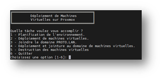
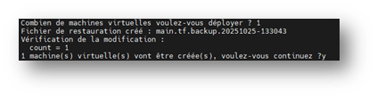
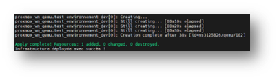
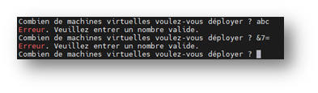
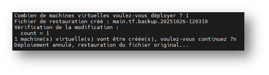
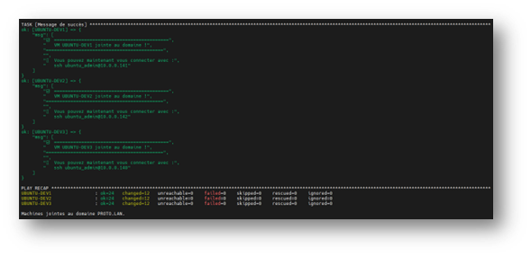
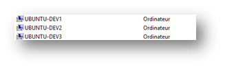

Ce fichier est un extrait d'une section du dossier professionnel TSSR, couvrant l'automatisation de tâches à l'aide de scripts.
## I. **Contexte et besoins**

Les manipulations ont été effectuées dans un environnement de test afin de valider la solution mise en place. J’ai reproduit l’infrastructure de production dans un hyperviseur de type 1 Proxmox dans lequel on retrouve :

- Un contrôleur de domaine Windows Server 2025 (domaine PROTO.LAN)
- Un serveur Ubuntu LTS 22.04 relié au domaine, hébergeant un partage Samba contenant les fichiers de configurations.

**Problématique rencontré** :

Une équipe qui voudrait déployer des machines virtuelles Linux jointe au domaine PROTO.LAN est confrontée à plusieurs problèmes. Le premier étant le déploiement manuel de chaque VM puis de leur configuration individuelle. Ce processus peut être long et fastidieux et il pourrait engendrer une perte d’efficacité. De plus, un risque d’erreurs humaine au niveau des configurations est toujours présent, ce qui pourrait générer des incidents ou des incohérences. Enfin, l’absence de standardisation rend ce processus difficile à mesurer, et par conséquent, à améliorer.

Mon objectif a été d’automatiser de bout en bout ce processus avec un seul point d’entrée, utilisable par l’équipe.

## II. **Analyse et conception**

Choix techniques :

- J’ai réalisé un script Bash, qui est disponible nativement sur le système, mais aussi léger et rapide à exécuter. Il est idéal pour orchestrer des outils externes (notamment la facilité à appeler des commandes du système et la gestion des codes retour).
- J’ai mis en place un menu interactif dans le but de faciliter son utilisation par plusieurs membres d’une équipe, quel que soit leur niveau technique. Ce menu permet, selon le besoin, de choisir une exécution d’actions précises (planification, déploiement, configuration) ou complète.
- J’ai choisi d’implémenter une architecture modulaire avec des fonctions réutilisables, chacune gérant une tâche spécifique. Cela a pour but d’éviter que le script soit trop verbeux, en facilitant sa lisibilité et maintenabilité.

- J’ai utilisé les outils suivants :
	- Terraform : Il permet le provisionnement de VMs sur Proxmox à partir d’un Template Ubuntu 22.04. Sa configuration, entièrement via des fichiers, a l’avantage de le rendre reproductible et traçable favorisant une approche Infrastructure as Code.
	- Ansible : Il est utilisé pour automatiser la configuration post-déploiement et la jointure au domaine des VMs. Sa principale force réside dans le déterminisme de ses actions (l’_idempotence_) : un même playbook produit toujours le même résultat, garantissant la cohérence des environnements.
	- Le script Bash réalisé : Il sert de point d’entrée unique pour orchestrer ces deux outils.

Ce script contient les fonctionnalités suivantes :
- Validation des entrées utilisateur
- Sauvegarde automatique avant modification
- Confirmations multiples
- Des choix d’actions multiples

## III.**Réalisation**

Le script complet se trouve en **[Annexe n°10](#Annexe10)**.

### 1. **Structure du script**

J’ai commencé par initialiser les variables suivantes :

```bash
#!/bin/bash

INITIAL_DIR=$(pwd)
TERRAFORM_DIR="/srv/samba/terraform/environments/production"
ANSIBLE_DIR="/srv/samba/ansible"
```

Celles-ci m’ont permis de centralisée les chemins, rendant le code moins verbeux et facilitant sa maintenance.

J’ai ensuite défini mes fonctions. Elles m’ont permis une architecture modulaire en « bloc » de fonctions.

Enfin, j’ai créé le bloc principal du script à l’aide d’une boucle `while`. C’est ici que les fonctions sont appelées et enchaînées afin d’assurer le bon déroulement de l’exécution du script.

### 2. **Détail des fonctions clés**

Dans cette section je vais expliquer les fonctions les plus importantes dans ce script.

- Validation des entrées avec la fonction `enterVm` :

```bash
function enterVm ()
{
    while true; do
        read -p "Combien de machines virtuelles voulez-vous déployer ? " vmCount
        # utilisation de regex : uniquement des chiffres
        if [[ ! $vmCount =~ ^[0-9]+$ ]]; then
            echo "Erreur. Veuillez entrer un nombre valide."
            continue
        fi

		# valeur minimum requise
        if [[ $vmCount -lt 1 ]]; then
            echo "Erreur. Le nombre doit être supérieur à 0."
            continue
        fi

		# seuil d’alerte si déploiement massif
        if [[ $vmCount -gt 10 ]]; then
            echo "Attention : un nombre important de machines virtuelles va être créé."
            read -p "Voulez-vous continuer ? (Y/n) " -n 1 -r
            echo
            # confirmation supplémentaire (regex, n’accepte que les caractères Y et y)
            if [[ ! $REPLY =~ ^[Yy]$ ]]; then
                continue
            fi
        fi
        break
    done
```
                           Extrait n°1 de la fonction enterVm

Cette fonction demande une saisie à l’utilisateur quant au nombre de machines virtuelles qu’il souhaite créer. Cette fonction est une boucle qui se répète tant que la saisie utilisateur n’est pas valide. J’ai utilisé des RegEx (_Regular Expression_) pour empêcher l’injection accidentelle ou malveillante de caractères inattendus. Enfin j’ai choisi d’ajouter un seuil d’alerte quand un grand nombre de VM est entré dans le but d’éviter une surcharge de l’infrastructure ; celui-ci est accompagné d’une confirmation supplémentaire.

- Sauvegarde automatique dans la fonction `enterVm` :

```bash
cd "$TERRAFORM_DIR"
backupFile="main.tf.backup.$(date +%Y%m%d-%H%M%S)"
cp main.tf "$backupFile"
echo "Fichier de restauration créé : $backupFile"
...
if [[ ! $REPLY =~ ^[Yy]$ ]]; then
    echo -e "Déploiement annulé, restauration du fichier original..."
    mv "$backupFile" main.tf
    return 1
fi
```
                           Extrait n°2 de la fonction enterVm

Dans cette fonction j’ai pris soins d’ajouter une sauvegarde de fichier de déploiement de Terraform (main.tf) afin d’assurer une protection contre les erreurs. Je me suis assurer d’ajouter un horodatage unique à la copie crée permettant un rollback rapide.

- Modification dynamique de valeur dans un fichier :

```bash
sed -i '/resource "proxmox_vm_qemu"/,/^}/ s/count = [0-9]*/count = '$vmCount'/' main.tf
```
                           Extrait n°3 de la fonction enterVm

Toujours dans la fonction `enterVm`, j’ai ajouté cette ligne me permettant de modifier le fichier de déploiement de Terraform directement depuis le script, sans intervention manuelle. J’ai utilisé la commande `sed`, puis je l’ai affinée à l’aide d’arguments me permettant de faire correspondre la ligne souhaitée. La valeur `count` remplacée dans le fichier est stockée dans la variable `$vmCount` correspondant au nombre de machines virtuelles à créer dans notre script.

- Orchestration conditionnelle :

```bash
if [ $choice == "1" ]; then
     initTerraform
     if enterVm; then
         planTerraform
     fi
```
 
Cette orchestration permet de chaîner les étapes lors de l’exécution du script, ce qui permet l’arrêt du script en cas d’annulation par l’utilisateur.

### 3. **Sécurisation**

- J’ai placé dans ce script divers mécanismes de sécurité tel que des confirmations avant des action irréversibles :

```bash
read -p "Voulez-vous appliquer ces changements ? (Y/n): " -n 1 -r
echo
if [[ ! $REPLY =~ ^[Yy]$ ]]; then
     echo -e "Déploiement annulé"
     return 1
fi
```
                           Extrait n°1 de la fonction planTerraform

- L’affichage de la planification Terraform pour vérifier la conformité de la configuration :

```bash
echo -e "Planification de l'infrastructure..."
cd "$TERRAFORM_DIR"
terraform plan -out plan
```
                           Extrait n°2 de la fonction planTerraform

- Et enfin une vérification des modifications apportées au fichier principal Terraform main.tf, à l’aide de la commande `grep "count = " main.tf`.

### 4. **Tests effectués**

Pour vérifier que le script est fonctionnel j’ai procédé à une batterie de tests :


|         |
| ------------------------------------------ |
| Affichage du menu du script de déploiement |

**Déploiement de VMs :**

|  |
| --------------------------------------- |
| Mécanisme de saisie de l'utilisateur    |

J’ai commencé par tester le déploiement d’une seule VM. J’exécute mon scripte et je sélectionne le deuxième choix dans le menu.

On peut voir que la saisie du nombre de VM fonctionne, qu’un fichier de restauration est créé. De plus les mécanismes de vérification et de confirmation semblent opérés.

|   |
| -------------------------------------------------- |
| Affichage du succès du déploiement dans la console |

On peut voir que le script confirme la création d’une nouvelle VM. Je vais vérifier sur mon hôte Proxmox, c’est le cas.

|                                        |
| ------------------------------------------------------------------- |
| Affichage de la nouvelle VM créée sur l’interface de l'hôte Proxmox |

J’ai réitéré le test en créant cette fois ci 3 VMs avec succès :

- **Test de validation des entrées utilisateur :**

|                                           |
| -------------------------------------------------------------------------------------------- |
| Boucle de validation refusant les lettres et caractères spéciaux, puis redemande une saisie. |

Dans un second temps j’ai confronté le script à des saisies invalides (lettres, caractères spéciaux, nombres négatifs) dans le but de tester sa robustesse. Le script refuse ces entrées puis redemande une saisie valide.

- **Test de restauration après backup :**

J’ai par la suite effectué un test pour m’assurer que le fichier principal de déploiement Terraform soit correctement restauré si le déploiement est annulé prématurément.  J’ai donc lancé un déploiement puis choisis délibérement de ne pas continuer le prcessus. Dans la capture ci-dessous (_Figure n°1_) un fichier de restauration a été crée le 26/10/2025 à 12:03, puis confirme la restauration du fichier après annulation. J’ai par la suite vérifié le contenu du dossier Terraform (où se situe la fichier concerné) avec la commande ls -la (_Figure n°2_). Je constate la présence du fichier main.tf modifié dernièrement le 26/10/2025 à 12 :03 ; la restauration a bien été effectuée.

|                      |
| ----------------------------------------------------------------------------- |
| Figure n°1 Lancement puis annulation d’un déploiement avec saisie utilisateur |

|                                             |
| ------------------------------------------------------------------------------------ |
| Figure n°2 Résultat de la commande `ls -la` dans le dossier principal de déploiement |

- **Vérification de la jointure au domaine PROTO.LAN après le déploiement :**

Ce test est le plus important, j’ai déployé plusieurs VMs et vérifié leur intégration au domaine PROTO.LAN. J’ai lancé le processus en sélectionnant le quatrième choix dans le menu du script, puis après avoir suivis les étapes de confirmations la console me retourne la création et la jointure effectuée de 3 nouvelles machines virtuelles. J’ai paramétré Ansible pour qu’il me retourne un message personnalisé quand la tâche réussie. Je retrouve des informations telles que le message de confirmation du bon déroulement de l’opération ainsi que la commande pour tester la connexion SSH sur les nouvelles machines.

|                                        |
| --------------------------------------------------------------------------------------------------------- |
| Résultat d'un déploiement complet avec Terraform suivis d'une jointure au domaine automatisée par Ansible |

Je me rends sur le contrôleur de domaine pour vérifier la présence des nouvelles VMS :

|                                                |
| --------------------------------------------------------------------------------- |
| Présence des 3 nouvelles VMs dans le conteneur Computers du contrôleur de domaine |


### 5. **Résultats et bilan**

Au final de la création de ce script en découle plusieurs gains mesurables, tel que la réduction du temps de déploiement de machines virtuelles, la fiabilité lors d’une jointure au domaine (aucunes erreurs rencontrées) et la standardisation de ce processus qui est le même à chaque fois.

Les plus grandes difficultés dans ce projet furent la validation des regex pour empêcher les injections et la manipulation de valeurs dans un fichier depuis le script.

Cette solution est encore largement améliorable, en effet il serait possible d’ajouter de nouvelles fonctionnalités comme la gestion du choix des Template de VM dans le menu ou encore une journalisation dans des fichiers dédies.