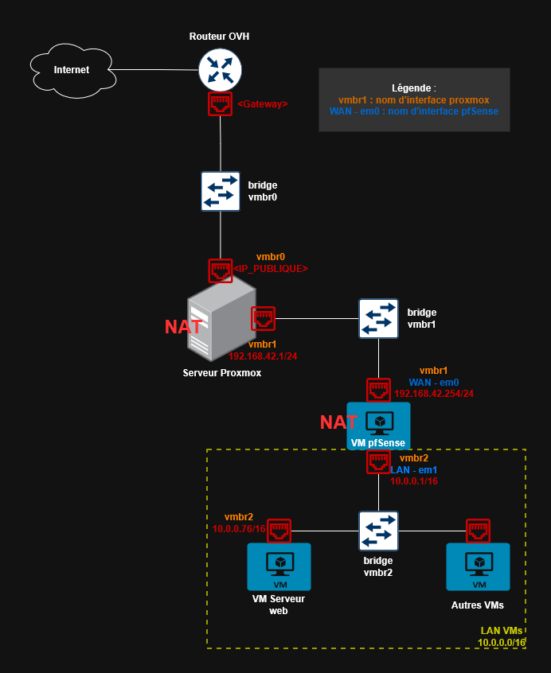

# Migration d'une infrastructure virtualisée Proxmox

> **Contexte :** Migration d'un serveur dédié OVH vers un nouveau serveur OVH, incluant le transfert de VMs critiques (pfSense, serveur web) avec maintien des interconnexions réseau.

---

## I. Contexte

Un serveur OVH avec un hôte Proxmox contenant des VMs va être décommissionné. J'ai besoin de son contenu pendant encore quelques temps ; j'ai donc loué un nouveau serveur qui a lui-même son hôte Proxmox.

La configuration du réseau est un double NAT, ou les VMs sont derrières un routeur pfSense qui a le rôle de passerelle.

A noter que certaines machines virtuelles méritent une attention particulière comme :

- Le routeur pfSense qui fournit l'accès à internet, les règles de pare-feu et un VPN client-à-site OpenVPN.
- Le serveur de déploiement automatisé pour lequel l'ancien hôte Proxmox possède des jeton API pour que Terraform puisse déployer des VMs.
- Le serveur web sur lequel j'ai dû m'assurer d'un minimum de temps d'indisponibilité du site web et qu'il soit toujours accessible après la migration.

---

## II. Planification

Avant de procéder à la migration j'ai planifié l'opération pour avoir le minimum d'interruptions de services. Mon plan a été :

- Création d'une grappe de serveur (cluster) temporaire depuis l'ancien serveur avec le nouveau.
- Configuration du nouvel hôte Proxmox pour qu'il ait les mêmes paramètres réseau (route, NAT et redirection de ports).
- Migration « à chaud » des VMs classiques et des Templates.
- Migration hors lignes des machines virtuelles critiques. En effet celles-ci ont été arrêtées pour ne pas rencontrer de problèmes lors de la migration, celles-ci ont aussi des snapshots (ce qui empêche la migration à chaud sur Proxmox, en raison de contraintes de cohérence des données). Elles seront migrées dans cet ordre :
    1. Migration du serveur de déploiement.
    2. Prévention de la maintenance aux utilisateurs puis migration du serveur web.
    3. Migration du routeur pfSense.
    4. Test et ajustement de ces VMs.

---

## III. Création du cluster et migration des machines virtuelles

### 1. Création d'une grappe de serveur

J'ai commencé par la création d'un cluster depuis l'ancien hôte Proxmox (_ns-ancien-serveur_) qui accueillera le nouvel hôte (_ns-nouveau-serveur_). Ce cluster de serveur m'a permis d'avoir la possibilité d'effectuer des migrations de machines virtuelles entre les deux nœuds. A noté que sur Proxmox cette opération ne peut s'effectuer que dans cet ordre, le nouvel hôte ne peut pas devenir le nœud principal car l'ancien nœud contient des VMs. Vous trouverez la procédure documentée de la création du cluster en [Annexe n°1](#annexe-1--cr%C3%A9ation-du-cluster-proxmox).

Le cluster Proxmox a été créé avec succès, les deux nœuds sont désormais visibles et le quorum est actif :

```bash
pvecm status
```

```
Cluster information
-------------------
Name:             replica-cluster
Config Version:   2
Transport:        knet
Secure auth:      on

Quorum information
------------------
Expected votes:   2
Highest expected: 2
Total votes:      2
Quorum:           2
Flags:            Quorate

Membership information
----------------------
Nodeid   Votes  Name
     1       1  ns-ancien-serveur (local)
     2       1  ns-nouveau-serveur
```

### 2. Migration de VMs online

J'ai commencé par migrer une VM de test afin de m'assurer du bon fonctionnement de l'opération. J'ai donc choisi de migrer la VM DebianTestAD en cours de fonctionnement :

```bash
# Migration à chaud vers le nouveau nœud
qm migrate 161 ns-nouveau-serveur --online
```

```
Starting migration of VM 161 to node 'ns-nouveau-serveur'
...
migration finished successfully
```

La machine virtuelle est toujours en ligne et se situe désormais sur le nouveau nœud _ns-nouveau-serveur_. Sur la console de la VM j'ai pu constater qu'il n'y a eu aucune interruption :

```bash
uptime
```

```
20:25:49 up 8 days, 8:39, 1 user, load average: 0.00, 0.00, 0.00
```

---

## IV. Migration des machines virtuelles critiques et maintien des interconnexions réseau

Pour rappel, sur l'hôte _ns-ancien-serveur_ étaient présent un routeur pfSense et un serveur web Nginx. Le routeur nécessite une attention particulière car c'est lui qui fournit les interconnexions réseau entre les VMs du nœud.

Vous trouverez dans l'[Annexe n°2](#annexe-2--diagramme-r%C3%A9seau) le diagramme du réseau qui a été migré.

Dans un premier temps j'ai commencé par la migration hors ligne du routeur. Avant de procéder à la migration j'ai effectué une phase préparatoire durant laquelle j'ai fait une sauvegarde de la configuration pfSense, ainsi qu'informer les utilisateurs de l'application web de l'interruption de service à venir.

Les préparatifs d'avant migration ainsi que l'état actuel du routeur se trouvent dans l'[Annexe n°3](#annexe-3--%C3%A9tat-du-routeur-pfsense-avant-migration).

Cinq minutes avant la maintenance j'ai effectué les dernières vérifications :

```bash
# Vérification que pfSense répond
ping -c 4 10.0.0.1
```

```
PING 10.0.0.1 (10.0.0.1) 56(84) bytes of data.
64 bytes from 10.0.0.1: icmp_seq=1 ttl=64 time=0.382 ms
64 bytes from 10.0.0.1: icmp_seq=2 ttl=64 time=0.336 ms
64 bytes from 10.0.0.1: icmp_seq=3 ttl=64 time=0.253 ms
64 bytes from 10.0.0.1: icmp_seq=4 ttl=64 time=0.282 ms
--- 10.0.0.1 ping statistics ---
4 packets transmitted, 4 received, 0% packet loss, time 3070ms
```

Début de la maintenance, j'ai arrêté la pfSense proprement depuis l'interface web. Une fois celle-ci hors ligne j'ai procédé à la migration sur le nœud ns-nouveau-serveur :

```bash
# Arrêt de la VM pfSense
qm shutdown 100 --timeout 60

# Migration hors ligne
qm migrate 100 ns-nouveau-serveur

# Démarrage sur le nouveau nœud
qm start 100
```

Le routeur a migré sur le nouvel hôte avec succès, j'ai donc procédé aux vérifications post-migration.

Vous retrouverez la procédure de migration détaillée ainsi que des vérifications post-migration dans l'[Annexe n°4](#annexe-4--v%C3%A9rifications-post-migration).

Afin de pouvoir administrer les serveurs à distance, j'ai ajusté la configuration VPN client-à-site utilisée précédemment. Depuis l'interface web pfSense > VPN > OpenVPN il m'a suffi de modifier l'adresse IP (WAN) de l'hôte précédent afin d'entrer la nouvelle IP. J'ai finalement exporté le nouveau paramétrage sur le client OpenVPN.

---

## V. Migration et rétablissement des services web

Le serveur web Nginx a aussi été migré hors ligne, une fois sur la nouvelle grappe de serveur. Sur le nouveau nœud il devra être accessible sur le port 443 de l'adresse WAN de l'hôte ns-nouveau-serveur. J'ai donc dû ajuster la résolution de nom de domaine avec la nouvelle IP chez le fournisseur de nom de domaine (OVH) et modifier l'enregistrement de type A :

```bash
# Vérification de la propagation DNS (après modification chez OVH)
dig +short mon-domaine.fr A
```

```
<NOUVELLE_IP_PUBLIQUE>
```

J'ai vérifié que le site était de nouveau accessible :

```bash
curl -I https://mon-domaine.fr
```

```
HTTP/2 200
server: nginx
date: Sun, 03 Nov 2025 14:20:00 GMT
content-type: text/html; charset=UTF-8
```

Néanmoins j'ai pu constater qu'il subsistait un problème dans les certificats SSL/TLS qui assurent une connexion sécurisée. En effet après migration du serveur web vers nouvelle infrastructure, je dois régénérer les certificats SSL/TLS pour sécuriser les connexions HTTPS. Les certificats SSL/TLS sont composés d'un certificat public qui est lié au nom de domaine et d'une clé privée stockée sur le serveur web. L'autorité de certification va vérifier l'adresse IP vers laquelle le domaine pointe.

```bash
# Régénération des certificats Let's Encrypt
sudo certbot renew --force-renewal

# Vérification du nouveau certificat
sudo certbot certificates
```

```
Certificate Name: mon-domaine.fr
  Domains: mon-domaine.fr www.mon-domaine.fr
  Expiry Date: 2026-02-03 (VALID: 89 days)
  Certificate Path: /etc/letsencrypt/live/mon-domaine.fr/fullchain.pem
```

La migration est maintenant complètement achevée. Tous les serveurs et VMs sont maintenant fonctionnels et joignables depuis le réseau.

---

## VI. Annexes

### Annexe 1 : Création du cluster Proxmox

Je me suis assuré que les 2 hôtes ont la même version de Proxmox afin d'éviter tout problèmes de compatibilité :

```bash
# Sur les deux nœuds
pveversion
```

```
pve-manager/8.4.14/xxxxxxxx (running kernel: 6.8.12-x-pve)
```

J'ai ajouté dans les fichiers `/etc/hosts` les noms et adresses IP pour que les serveurs puissent **résoudre localement** leurs noms de domaine en adresse IP :

```bash
cat >> /etc/hosts << 'EOF'
<IP_PUBLIQUE_ANCIEN>    ns-ancien-serveur
<IP_PUBLIQUE_NOUVEAU>   ns-nouveau-serveur
EOF
```

J'ai ensuite effectué un test réseau pour m'assurer que les 2 hôtes communiquent :

```bash
# Depuis ns-ancien-serveur
ping -c 4 ns-nouveau-serveur
```

```
PING ns-nouveau-serveur (<IP_PUBLIQUE_NOUVEAU>) 56(84) bytes of data.
64 bytes from ns-nouveau-serveur: icmp_seq=1 ttl=51 time=23.0 ms
64 bytes from ns-nouveau-serveur: icmp_seq=2 ttl=51 time=23.1 ms
--- ns-nouveau-serveur ping statistics ---
4 packets transmitted, 4 received, 0% packet loss, time 3005ms
```

J'ai ensuite créé le cluster sur le nœud principal (_ns-ancien-serveur_) :

```bash
# Création du cluster sur le nœud principal
pvecm create replica-cluster
```

```
Corosync Cluster Engine Authentication key generator.
Gathering 2048 bits for key from /dev/urandom.
Writing corosync key to /etc/corosync/authkey.
Writing corosync config to /etc/pve/corosync.conf
Restart corosync and cluster filesystem
TASK OK
```

Sur le nœud principal j'ai récupéré les informations de jonction :

```bash
pvecm add ns-ancien-serveur --use_ssh
```

Du côté du nouvel hôte, j'ai rejoint le cluster :

```bash
# Sur ns-nouveau-serveur
pvecm add ns-ancien-serveur
```

```
Please enter superuser (root) password for 'ns-ancien-serveur': ********
Establishing API connection with host 'ns-ancien-serveur'
Login succeeded.
Request addition of this node
Join request OK, finishing setup locally
stopping pve-cluster service
backup old database to '/var/lib/pve-cluster/backup/config-xxxxxxxxxx.sql.gz'
waiting for quorum...OK
generating node certificates...
merge known_hosts file...
restart services...
successfully added node 'ns-nouveau-serveur' to cluster.
TASK OK
```

Le cluster a maintenant été créé, j'ai effectué quelques vérifications :

```bash
# Liste des nœuds du cluster
pvecm nodes
```

```
Membership information
----------------------
    Nodeid      Votes Name
         1          1 ns-ancien-serveur (local)
         2          1 ns-nouveau-serveur
```

---

### Annexe 2 : Diagramme réseau

**Architecture réseau de l'hôte Proxmox migré :**



**Flux réseau :**

- Port 443 (HTTPS) → NAT → pfSense → VM Web (10.0.0.10)
- Port 1194 (OpenVPN) → NAT → pfSense (terminaison VPN)

---

### Annexe 3 : État du routeur pfSense avant migration

Vérification de l'état général du système :

```bash
# Connexion SSH à pfSense
ssh admin@10.0.0.1

# Uptime et charge système
uptime
```

```
 2:19PM  up 80 days, 18:14, 1 user, load averages: 0.30, 0.18, 0.14
```

Vérification des interfaces réseau :

```bash
# Liste des interfaces actives
ifconfig -a | grep -E "^[a-z]|inet "
```

```
em0: flags=8843<UP,BROADCAST,RUNNING,SIMPLEX,MULTICAST>
        inet 192.168.42.254 netmask 0xffffff00 broadcast 192.168.42.255
em1: flags=8843<UP,BROADCAST,RUNNING,SIMPLEX,MULTICAST>
        inet 10.0.0.1 netmask 0xffffff00 broadcast 10.0.0.255
em2: flags=8843<UP,BROADCAST,RUNNING,SIMPLEX,MULTICAST>
        inet 172.16.0.1 netmask 0xffff0000 broadcast 172.16.255.255
```

Vérification de la connectivité internet :

```bash
ping -c 4 8.8.8.8
```

```
PING 8.8.8.8 (8.8.8.8): 56 data bytes
64 bytes from 8.8.8.8: icmp_seq=0 ttl=112 time=3.54 ms
64 bytes from 8.8.8.8: icmp_seq=1 ttl=112 time=3.44 ms
--- 8.8.8.8 ping statistics ---
4 packets transmitted, 4 packets received, 0.0% packet loss
```

Sauvegarde de la configuration avant migration :

```bash
# Depuis l'interface web : Diagnostics > Backup & Restore
# Ou via CLI :
cat /cf/conf/config.xml > /tmp/pfsense-backup-$(date +%Y%m%d).xml
```

---

### Annexe 4 : Vérifications post-migration

Avant d'effectuer le démarrage de la VM pfSense, je m'assure que la table de routage sur le nouvel hôte Proxmox est identique à l'ancien :

```bash
# Sur ns-nouveau-serveur
ip route show
```

```
default via 192.168.42.1 dev vmbr0
10.0.0.0/24 dev vmbr1 proto kernel scope link src 10.0.0.254
172.16.0.0/16 dev vmbr2 proto kernel scope link src 172.16.0.254
192.168.42.0/24 dev vmbr0 proto kernel scope link src 192.168.42.254
```

Vérification des règles NAT sur l'hôte :

```bash
iptables -t nat -L -n -v | grep DNAT
```

```
    0     0 DNAT  tcp  --  *  *   0.0.0.0/0    0.0.0.0/0    tcp dpt:80  to:192.168.42.254:80
    0     0 DNAT  tcp  --  *  *   0.0.0.0/0    0.0.0.0/0    tcp dpt:443 to:192.168.42.254:443
    0     0 DNAT  udp  --  *  *   0.0.0.0/0    0.0.0.0/0    udp dpt:1194 to:192.168.42.254:1194
```

La VM pfSense se trouve maintenant sur le nouveau nœud, je la démarre :

```bash
qm start 100
```

Celle-ci démarre correctement et m'affiche les interfaces réseau :

```bash
# Console pfSense après boot
*** Welcome to pfSense 2.7.2-RELEASE (amd64) on NAT-pfSense ***

 WAN (em0)       -> v4: 192.168.42.254/24
 LAN (em1)       -> v4: 10.0.0.1/16
 OPT1 (em2)      -> v4: 172.16.0.1/16
```

Je m'assure que tous les services sont toujours actifs :

```bash
# Via SSH sur pfSense
pfSsh.php playback svc status
```

```
Service            Status
-------            ------
dhcpd              running
dpinger            running
ntpd               running
openvpn            running
sshd               running
syslogd            running
unbound            running
```

Je vérifie les logs du système pour voir si des erreurs se sont produites :

```bash
clog /var/log/system.log | tail -20
```

Je lance des tests réseau pour m'assurer que la VM est bien joignable et a un accès à internet :

```bash
# Test connectivité LAN
ping -c 4 10.0.0.10
```

```
PING 10.0.0.10 (10.0.0.10): 56 data bytes
64 bytes from 10.0.0.10: icmp_seq=0 ttl=64 time=0.382 ms
--- 10.0.0.10 ping statistics ---
4 packets transmitted, 4 packets received, 0.0% packet loss
```

```bash
# Test connectivité internet
ping -c 4 google.com
```

```
PING google.com (142.250.185.142): 56 data bytes
64 bytes from 142.250.185.142: icmp_seq=0 ttl=112 time=3.44 ms
--- google.com ping statistics ---
4 packets transmitted, 4 packets received, 0.0% packet loss
```

---

## VII. Bilan et points d'amélioration

### Résultats

- Migration réalisée avec succès
- Temps d'indisponibilité du site web : ~40 minutes
- Aucune perte de données
- VPN opérationnel après reconfiguration

### Difficultés rencontrées

- Impossibilité de migrer à chaud les VMs avec snapshots (contrainte Proxmox)
- Régénération nécessaire des certificats SSL après changement d'IP

### Améliorations possibles

- **Automatisation** : Script Ansible pour la configuration post-migration
- **Monitoring** : Mise en place d'alertes pour détecter les interruptions
- **Documentation** : Pour les futures migrations

---

_Documentation réalisée dans le cadre du titre professionnel TSSR - Tom GUENIN_